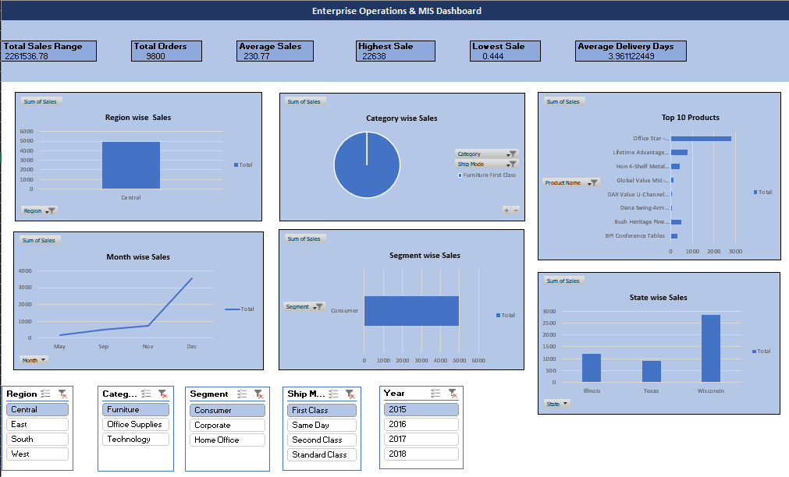

# 📊 Enterprise Operations and MIS Dashboard (Excel)

## 📌 Project Overview

The **Enterprise Operations & MIS Dashboard** is an interactive dashboard built entirely in **Microsoft Excel** to analyze business operations and present key performance indicators (KPIs) in a clear and visually appealing format.

This project demonstrates the complete data analysis workflow—from raw data collection and cleaning to pivot table analysis and dashboard creation—helping stakeholders monitor business performance and make informed decisions.

---

## 🎯 Objectives

- Analyze enterprise operational data
- Clean and prepare raw datasets
- Generate meaningful business insights
- Build an interactive dashboard using Excel
- Monitor key business KPIs

---

## 🛠️ Tools & Technologies

- Microsoft Excel
- Pivot Tables
- Pivot Charts
- Slicers
- Conditional Formatting
- Excel Formulas

---

## 📂 Workbook Structure

The Excel workbook contains four worksheets:

### 📄 Sheet 1 – Raw Dataset
- Original business dataset
- Source data used for analysis

### 📄 Sheet 2 – Cleaned Dataset
- Removed duplicate records
- Handled missing values
- Corrected inconsistent data
- Prepared dataset for analysis

### 📄 Sheet 3 – Pivot Tables
- Created multiple Pivot Tables
- Aggregated business metrics
- Generated summaries for dashboard

### 📄 Sheet 4 – Dashboard
Interactive dashboard containing:
- KPI Cards
- Pivot Charts
- Business Performance Metrics
- Trend Analysis
- Interactive Slicers
- Executive Summary

---

## ✨ Dashboard Features

- 📈 KPI Monitoring
- 📊 Interactive Charts
- 🎯 Business Performance Analysis
- 📅 Trend Analysis
- 📌 Executive Dashboard
- 🔍 Dynamic Filtering using Slicers

---

## 📷 Dashboard Preview

### Dashboard Overview

> *(Replace `dashboard1.png` with your actual screenshot filename.)*

---

## 📁 Files Included

- Enterprise_Operations_MIS_Dashboard.xlsx
- README.md
- Dashboard Screenshot(s)

---

## 💡 Skills Demonstrated

- Data Cleaning
- Data Preparation
- Data Analysis
- Dashboard Design
- KPI Development
- Pivot Tables
- Pivot Charts
- Business Reporting
- Data Visualization
- MIS Reporting

---

## 🚀 Future Improvements

- SQL Database Integration
- Power BI Version
- Automated Data Refresh
- Python-Based Data Processing
- Interactive Business Reporting

---

## 👩‍💻 Author

Shruti Ganbote

🎓 B.E. Computer Engineering (Honors in Data Science)

**Skills:** Python • SQL • Excel • Power BI • Machine Learning • Data Analytics
